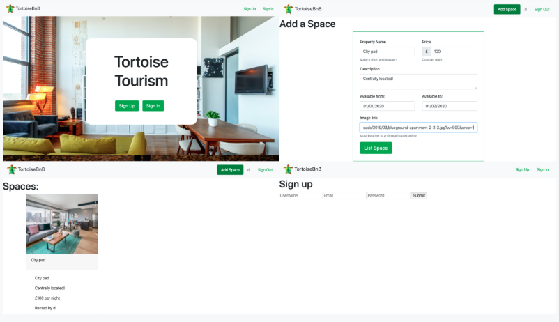

<h1 align="center">Elena Beccaro</h1>

[About ](#About) |
[Projects ](#Projects) |
[Skills ](#Skills) |
[Education ](#Education) |
[Experience ](#Experience) |
[Interests ](#Hobbies)

|Project        |Description                                           |Technologies and processes              |
|----------|------------------------------------------------------|----------------------------------------|
|[COVID-19-Tracker-Application](https://github.com/elebecca/COVID-19-Tracker-Application.git)</b>  </b>  |Create a full COVID-19 Tracker.   solo project 1.5 weeks weeks  GitHub repo [here](https://github.com/elebecca/COVID-19-Tracker-Application.git)  Deployed at [COVID-19-Tracker-Application](https://covid19statswebsite.netlify.com/) |React, API, Charts.JS, Material UI, HTML, CSS,  XP, Git|
[Minefiel](https://github.com/elebecca/Minefield)</b>  </b>  |Create a Minefield game.   solo project 1.5 weeks weeks  GitHub repo [here](https://github.com/elebecca/Minefield) | Javascript, CSS  XP, Git |
[PostBox](https://github.com/elebecca/MakersPostBox)</b>  </b>  |  PostBox is a Virtual gifting app.In these times of isolation it’s more important than ever to spread happiness. This is a virtual care packages to send to family, friends and other loved ones. Group project 1.5 weeks weeks  GitHub repo [here](https://github.com/elebecca/MakersPostBox) |Ruby on rails, Javascript , CSS, Bootstrap, HTML, RSpec, Capybara, PostgreSQL, TravisCI, CodeClimate, Heroku  |
|[Makersbnb](https://github.com/elebecca/Makersbnb.git)</b>  </b>  |A full stack Airbnb clone demonstrating core functionality  Group project 1.5 weeks weeks  GitHub repo [here](https://github.com/elebecca/Makersbnb.git) |Ruby, Rails, ActiveRecord (postgreSQL), RSpec, Capybara Code, Travis CI, Rubocop, Code Climate|

---------
## About
I am a passionate developer with a strong background in graphic design. I'm fascinated about the intersection of technology of creativity. I’ve  good communication skills, a can-do attitude and am always looking to go the extra mile. Recently I’ve been a graduate in Makers Academy (London's leading programming bootcamp) in order to become upskilled with best practice tools and methodologies.
I like to stay up to date with the latest frameworks and programming techniques.

## Projects

Whilst studying at Makers Academy I have fundamentally 'learnt how to learn' new technologies through pair programming, OO, TDD and XP principles. For a complete list of my projects, see my [Github](https://github.com/elebecca).

| Project title    | Timeframe          | Technologies        |
| ---                                                                     |---                 |---                                                        |

| [Post-box](https://github.com/elebecca/MakersPostBox) | 2 wk group project| An online game: Ruby on rails, Javascript , CSS, Bootstrap, HTML, RSpec, Capybara, PostgreSQL, TravisCI, CodeClimate, Heroku                                |
| [Thermostat](https://github.com/elebecca/thermostat)  | 2 days solo project| Aprojcet for a interactive thermometer: Javascript, Jasmin, Html, Css

## Skills

My skills are mainly focused in graphics design. However, I found out that coding is an endless source to release my inner creativity and problem-solving skills.

#### Languages & Frameworks: 
Ruby, Rails, RSpec, Sinatra, Capybara
JavaScript, ReactJS, jQuery, Jasmine
PostgreSQL, ActiveRecord
HTML5, CSS3, Bootstrap
#### CI and Accountability: 	
TravisCI, CodeClimate, Heroku
#### Design tools: 			
Adobe Photoshop/Illustrator/InDesign.

#### Another Skill

- Creative - I have learned to be creative with my problem-solving and try to look things with a different point of you.
- Adapt to changing environments - The biggest change was for me movine on one other country. A new culture, new language 
- with a different way to work.
- Organization and time managing - I worked many years like freelance it was necessary know how to manage the time and
  be able to focus in the priorities when there is a deadline.
- Multitasking - my job brought me to work often at more than one task at the time.

## Experience
### Makers Academy
(start_date Jauary 2020 to end_date April 2020)  
*Software Engineer Training*
Makers Academy is a 16-week intensive coding bootcamp focused on teaching the fundamentals of software engineering with Ruby & JavaScript.

- Write code using TDD
- Creating functional database in PostgreSQL
- Build a web app back-end and front-end in Javascript and Ruby 
- Version control with Git, and collaboration with GitHub
- Follow an effective debugging process

#### Achievements
- Write clean, reliable, and maintainable code
- Principles of object-oriented design and test-driven development
- Pair using the driver-navigator style
- Work in an agile development team
- Run stand-ups and retrospectives
- Break down projects into tasks and allocate them to pairs

### Freelance
(start_date September 2013 to end_date now)    
*Graphic Designer*  

- Development of user interfaces using CSS, HTML, JQuery and Javascript
- Use of Bootstrap for UI design.
- Use of Adobe Photoshop/Illustrator/InDesign.
- Design of logos, flyers, advertisements, illustrations, calendars, posters and corporate identity.
- Creation of business cards and brochures.
- Creation of custom-made solutions based on customer’s needs.

#### Achievements
- Work effectively both in team-based environments and independently
- Attention to detail 
- Self-trained freelance web developer.

### IntegrityUK
(start_date July 2015 to end_date June 2016)   
*Graphic designer* 

- Updating the UI in the main website with HTML/CSS.
- Use of Adobe Photoshop/Illustrator/InDesign.
- Creation of infographics and images for publications in social media.
- Developing the brand design

#### Achievements
- Working on several projects simultaneously. 
- Manage the time effectively, focusing on tasks of high importance and urgency first.

## Education

#### University of Padua (start_date 2009 to end_date 2013)

- Qualification awarded: Bachelor degree in Contemporary Arts

#### Any other qualifications

- Responsive Web Design - “Freecode” (https://www.freecodecamp.org) 
- HTML, CSS, JQuery & Javascript Workshop - “Codebar London” (https://codebar.io/london)

## Hobbies

- painting 
- traveling 
- cooking
- always looking new things to do
